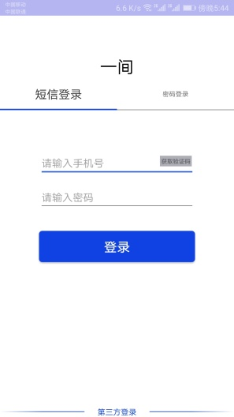
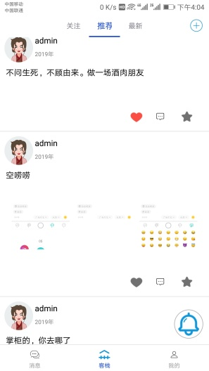

## 毕业设计-《一间》APP
# 1. 简介  
       生而为人，谁没有一点故事呢？有的会讲出来，有的只会埋在心里。有些事无法与他人言语，可以对一间讲，在客栈讲。
---  
       写在前面，无论怎样，都希望一间不温不火，做一个有个性的平台。备好酒水，讲讲故事，做一个酒肉朋友。
       不要为了盈利而改变初衷，宁为玉碎，不为瓦全。来到这里的都是闲人，谁没有一点散事。
       我随便说说，你随便听听，匆匆过客，纸过云烟。
---
# 2.框架
        1. Retrofit2+RxJava2网络请求框架，view注入框架butterknife，图片加载框架glide，BaseQuickAdapter和SmartRefreshLayout肯定会用的，知乎的图片选择框架。
    还有一些比较好用的东西。
        2. 聊天相关的东西全部使用了融云框架
        实在没啥技术
# 3.环境
        1. Android 27（8.1）
        2. Android Studio   3.0.1
        3. Gradle Version   4.4
        4. Android Plugin Version   3.1.0
# 4.功能
        1. 发布带有照片、文字的动态信息
        2. 对动态评论、点赞、收藏、举报
        3、关注好友进行聊天
# 5. APP
        1. 下载地址 [蒲公英托管平台](https://www.pgyer.com/oDWs "Aroom").   （密码：123）

        - 
        - 
        - 
        - 
